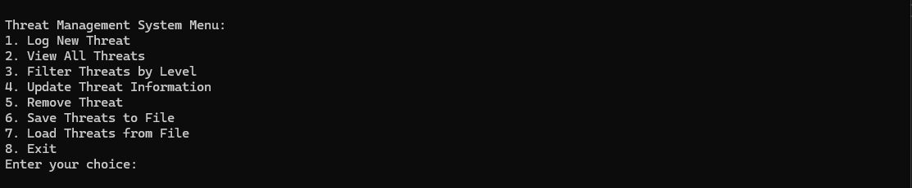
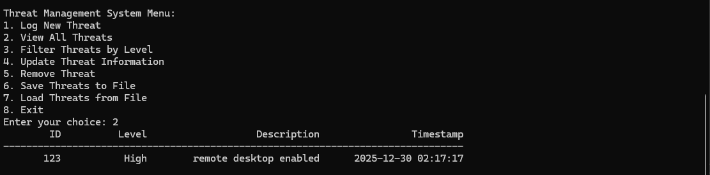
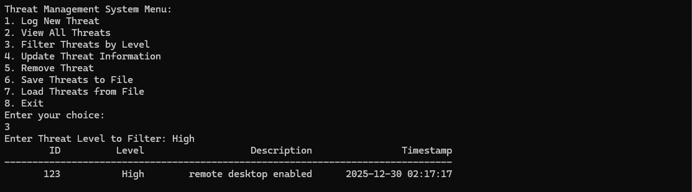

# ThreatController (C++ Console Application)

A menu-driven C++ console application designed to simulate a basic threat management system.  

The program allows users to create, view, update, filter, and store security threats using a simple and clear interface.

This tool was built for learning, lab environments, and portfolio demonstration, following basic cybersecurity and software design concepts.

---

## Features

The application provides a simple way to manage and track simulated security threats without complex setup.

### Threat Management

- Add new threats
- View all stored threats
- Update threat information
- Remove threats from the system

### Threat Analysis

- Filter threats by severity level
- Display threat details in a clear format

### Data Storage

- Save threat data to a file
- Load threat data from a file
- Persistent storage between program runs

### User Interface

- Menu-driven console interface
- Clear input prompts and feedback
- Simple navigation using number-based menus

---

## How to Run

Follow these steps to build and run the application.

### Step 1 Open the project

Open the solution file in Visual Studio.

### Step 2 Build the project

Build the solution using Debug or Release mode.

### Step 3 Run the program

Start the application and follow the on-screen menu options.

---

## Screenshots

Below are example screenshots showing the program running in a Windows console environment.  

Screenshots are taken from a local lab setup.

### Main Menu

The main menu allows users to access all threat management features quickly.

### View All Threats

This screen displays all recorded threats currently stored in the system.

### Filter Threats by Level

Threats can be filtered based on severity level for faster review.

---

## Logging and Data Handling

- Threat data can be saved to disk
- Saved data can be reloaded on program start
- Helps simulate real-world logging and record keeping

---

## Purpose

This project demonstrates:

- Object-oriented programming in C++
- Basic threat tracking logic
- File input and output
- Console-based user interaction

It is intended for educational and portfolio use, not as a production security system.

---

